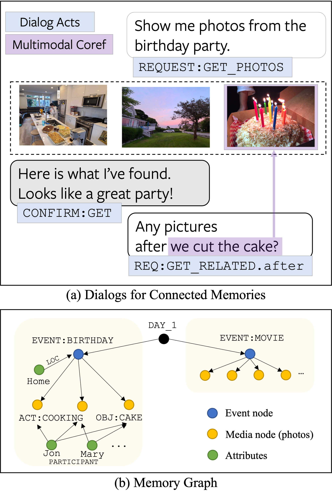

# Navigating Connected Memories with a Task-oriented Dialog System

This repository contains the code to reproduce results from the following paper:

**Navigating Connected Memories with a Task-oriented Dialog System**  
Seungwhan Moon\*, Satwik Kottur\*, Alborz Geramifard, Babak Damavandi  
[[PDF][paper_workplace]][[Github][github]]  
*Empirical Methods in Natural Language Processing (EMNLP), 2022*
\*=equal contribution

### Abstract




Recent years have seen an increasing trend in the volume of personal media captured by users, thanks 
to the advent of smartphones and smart glasses, resulting in large media collections.
Despite conversation being an intuitive human-computer interface, current efforts focus mostly
on single-shot natural language based media retrieval to aid users query their media and 
re-live their memories. This severely limits the search functionality as users can neither ask 
follow-up queries nor obtain information without first formulating a single-turn query.

In this work, we propose *dialogs for connected memories* as a powerful tool to empower
users to search their media collection through a multi-turn, interactive conversation.
Towards this, we collect a new task-oriented dialog dataset COMET, which contains $11.5k$ 
user↔assistant dialogs (totalling $103k$ utterances), grounded in simulated personal memory graphs.
We employ a resource-efficient, two-phase data collection pipeline that uses:
(1) a novel multimodal dialog simulator that generates synthetic dialog flows grounded in 
memory graphs, and,
(2) manual paraphrasing to obtain natural language utterances.
We analyze \dn, formulate four main tasks to benchmark meaningful progress, and adopt
state-of-the-art language models as strong baselines, in order to highlight the 
multimodal challenges captured by our dataset.
Our code \& data will be made publicly available.


### Code Structure

The code is organized into two folders:

**A. Multimodal Dialog Simulator** (`dialog_simulator/`):  
Conditioned on the memory graphs generated, the multimoda dialog simulator produces synthetic
dialog flows between a user and an assistant. 
These flows are later paraphrased using human annotators to draw from natural language utterances.

* `AssistantSimulator.py`
* `Data.py`
* `DummyMemoryDialogModel.py`
* `GoalGenerator.py`
* `InteractiveDialogHandler.py`
* `MemoryDialogModel.py`
* `MemoryDialogSimulator.py`
* `MemoryServiceAPI.py`
* `SimulatorBase.py`
* `UserSimulator.py`
* `constants.py`
* `get_user_utterances.py`
* `main.py`
* `merge_data_json.py`
* `merge_synth_and_appen.py`
* `utils.py`


**B. Memory-grounded Dialog Models** (`models/`):

There are two type of models used in this work:

1. Text-only GPT-2 model: Memories are represented using their ids.
    * `run_preprocess_gpt2.sh`: Preprocessing the memory dialog dataset to make it ingestible for GPT-2 model training
    * `run_train_gpt2.sh`: Trains GPT-2 model (text-only)
    * `gpt2_dst/`: Folder with GPT-2 model
    * `run_evaluate_gpt2.sh`: Contains commands to evaluate a trained GPT-2 model on memory dialogs
    * `run_evaluate.sh`: Contains commands to evaluate output prediction JSON of any model on memory dialogs
    * `utils/`: Additional utility functions to train and evaluation GPT-2 model

2. Multimodal GPT-2 model: Memories are represented using their image features.
    * `run_me.sh`: Contains commands to train, evaluation, compile the results for GPT-2 (mm).
    * `utils/`: Additional utility functions to train and evaluation GPT-2 model(mm).


Please reach out to [Satwik Kottur][satwik_link] (skottur@fb.com) 
or [Suengwhan Moon][shane_link] (shanemoon@fb.com) for questions related to this repository.


If you find this repository useful, please cite our work:

```
@inproceedings{moon-kottur-2022-navigating,
    title = "Navigating Connected Memories with a Task-oriented Dialog System",
    author = "Moon, Seungwhan and 
    Kottur, Satwik Kottur and
    Geramifard, Alborz and
    Damavandi, Babak",
    booktitle = "Proceedings of the 2022 Conference on Empirical Methods in Natural Language Processing",
    month = dec,
    year = "2022",
    address = "Online and Abu Dhabi, United Arab Emirates",
    publisher = "Association for Computational Linguistics",
}
```


### LICENSE
*The majority of comet\_memory\_dialog is licensed under CC-BY-NC, however 
portions of the project are available under separate 
license terms: https://github.com/ictnlp/DSTC8-AVSD is licensed 
under the MIT license.*

[paper_pdf]: 
[github]:https://github.com/facebookresearch/comet_memory_dialog
[curated_lists]: https://drive.google.com/drive/folders/1V4RqUR0oSr2wwI4-ukx_V3NlP9IUHKoT?usp=sharing
[satwik_link]: https://satwikkottur.github.io/
[shane_link]: https://shanemoon.com/
